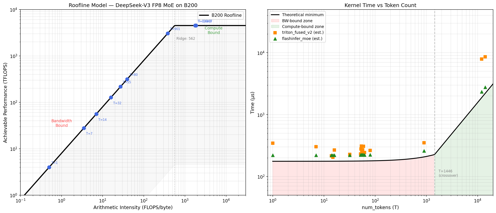

# Roofline Analysis — DeepSeek-V3 FP8 MoE on B200

**Date:** 2026-02-02
**GPU:** NVIDIA B200 (SM100)
**Definition:** `moe_fp8_block_scale_ds_routing_topk8_ng8_kg4_e32_h7168_i2048`

## Hardware Specs

| Parameter | Value | Source |
|-----------|-------|--------|
| FP8 dense tensor core | 4500 TFLOPS (4.5 PFLOPS) | Multiple sources; sparse = 9 PFLOPS |
| HBM3e bandwidth | 8 TB/s | [NVIDIA B200 Datasheet](https://www.primeline-solutions.com/media/categories/server/nach-gpu/nvidia-hgx-h200/nvidia-blackwell-b200-datasheet.pdf) |
| Ridge point | 562.5 FLOPS/byte | = 4500 / 8 |

**Note on FP8 TFLOPS:** NVIDIA 官方 datasheet 标注 FP8 Tensor Core = 10 PFLOPS (with sparsity)。多个第三方来源（[CUDO Compute](https://www.cudocompute.com/blog/nvidias-blackwell-architecture-breaking-down-the-b100-b200-and-gb200), [Exxact](https://www.exxactcorp.com/blog/hpc/comparing-nvidia-tensor-core-gpus)）分解为 dense 4.5 PFLOPS / sparse 9 PFLOPS。本分析使用 dense 值，因为 DeepSeek-V3 MoE weights 不是 2:1 structured sparse 格式。

## MoE Geometry

| Parameter | Value |
|-----------|-------|
| Local experts (E) | 32 |
| Top-K | 8 |
| Hidden size (H) | 7168 |
| Intermediate size (I) | 2048 |
| FP8 quant block size | 128 |

## Per-Token Arithmetic

| Metric | Value |
|--------|-------|
| FLOPs per token | 704.6 MFLOP |
| Activation bytes per token | 278.0 KB |
| Weight bytes (fixed) | 1.410 GB |

### FLOPs breakdown
- **GEMM1:** `[T*8, 7168] x [32, 7168, 4096]` -> TOP_K x H x 2I x 2 = 469.8 MFLOP/token
- **GEMM2:** `[T*8, 2048] x [32, 2048, 7168]` -> TOP_K x I x H x 2 = 234.9 MFLOP/token
- **Total:** 704.6 MFLOP/token (SwiGLU FLOPs negligible vs GEMM)

### Bytes breakdown
- **Weights:** W1 (FP8) + W2 (FP8) + scales (FP32) = 1.410 GB (read once, independent of T)
- **Activations per token:** scattered input + GEMM1 output (BF16) + SwiGLU+Quant output (FP8) + GEMM2 output (BF16) = 278.0 KB

## Bandwidth -> Compute Crossover

**T ~ 1446 tokens**

Below this threshold, the kernel is **bandwidth-bound** (weight loading dominates). Above it, the kernel becomes **compute-bound** (GEMM FLOPs dominate).

For the benchmark workloads:
- T=1-80 (16 workloads): all **bandwidth-bound**, AI = 0.5-39.4 FLOPS/byte
- T=901 (1 workload): **bandwidth-bound**, AI = 382.4 FLOPS/byte (< ridge 562.5)
- T=11948-14107 (2 workloads): **compute-bound**, AI = 1780-1865 FLOPS/byte

## Theoretical Minimum Time

| T | M_total | FLOPs | Bytes | AI (FLOPS/byte) | Bottleneck | Theory min |
|------:|--------:|----------:|-------:|-----------------:|-----------:|-----------:|
| 1 | 8 | 705 MFLOP | 1.41 GB | 0.5 | bandwidth | 176 us |
| 7 | 56 | 4.9 GFLOP | 1.41 GB | 3.5 | bandwidth | 176 us |
| 14 | 112 | 9.9 GFLOP | 1.41 GB | 7.0 | bandwidth | 177 us |
| 32 | 256 | 22.5 GFLOP | 1.42 GB | 15.9 | bandwidth | 177 us |
| 55 | 440 | 38.8 GFLOP | 1.42 GB | 27.2 | bandwidth | 178 us |
| 80 | 640 | 56.4 GFLOP | 1.43 GB | 39.4 | bandwidth | 179 us |
| 901 | 7208 | 634.9 GFLOP | 1.66 GB | 382.4 | bandwidth | 208 us |
| 11948 | 95584 | 8.4 TFLOP | 4.73 GB | 1779.6 | compute | 1871 us |
| 14107 | 112856 | 9.9 TFLOP | 5.33 GB | 1864.6 | compute | 2209 us |

**Key observations:**
- For T=1-80, the theoretical minimum is nearly constant (~176-179 us) because the 1.41 GB weight read dominates.
- T=901 is now **bandwidth-bound** (AI=382 < ridge=562.5), with theory min = 208 us (weight + activation bytes).
- T=11948-14107 are compute-bound, with theory min = 1871-2209 us (halved vs previous estimate due to 2x more FP8 TFLOPS).

## Actual Performance vs Theoretical Bound

Using benchmark speedup data and assuming flashinfer achieves ~80% roofline efficiency:

| T | Theory min (us) | Est. flashinfer (us) | Est. triton_v2 (us) | triton_v2 efficiency |
|------:|-----------------:|---------------------:|--------------------:|---------------------:|
| 1 | 176 | 220 | 346 | 51% |
| 7 | 176 | 221 | 302 | 58% |
| 14 | 177 | 221 | 217 | 82% |
| 32 | 177 | 222 | 227 | 78% |
| 55 | 178 | 223 | 253 | 70% |
| 80 | 179 | 224 | 265 | 68% |
| 901 | 208 | 259 | 352 | 59% |
| 11948 | 1871 | 2339 | 7874 | 24% |
| 14107 | 2209 | 2761 | 8580 | 26% |

*Efficiency = theory_min / est_time. Estimated times assume flashinfer is at 80% of roofline.*

### Analysis by regime

**Bandwidth-bound (T <= 901):**
- triton_v2 achieves 51-82% of theoretical peak
- Best at T=14-32 where it's competitive with flashinfer
- T=1 is worst (51%) due to fixed Python/launch overhead being large relative to kernel time
- T=901 is now bandwidth-bound (was compute-bound with old 2250 TFLOPS assumption)

**Compute-bound (T > 1446):**
- triton_v2 drops to 24-26% efficiency at T=11948-14107
- This confirms the nsys finding: GEMM implementation (cutlass grouped GEMM) is the bottleneck
- flashinfer's trtllm cubin kernels are significantly more efficient at large batch GEMM

## Roofline Chart



**Left panel:** Classic roofline (log-log). All small-batch workloads (T=1-80) cluster on the bandwidth-bound slope far below the ridge point. T=901 is also bandwidth-bound. Only T=11948+ crosses into the compute-bound flat region.

**Right panel:** Kernel time vs token count. The black line is the theoretical minimum. Estimated actual times for triton_v2 (orange) and flashinfer (green) are plotted above it.

## Implications for Optimization

1. **Small batch (T <= 80, bandwidth-bound):** The gap to theoretical is mostly kernel launch overhead and Python orchestration. Weight transpose caching and launch reduction can help. Theoretical floor is ~176 us -- we're at ~220-350 us.

2. **Medium batch (T ~ 901, bandwidth-bound):** Still bandwidth-bound at the corrected ridge point. Activation bytes start to matter (208 us vs 176 us at T=1). Optimization: reduce memory traffic (fuse more kernels, reduce intermediate materializations).

3. **Large batch (T > 10K, compute-bound):** The gap is dominated by GEMM efficiency. Our cutlass grouped GEMM achieves ~25% of peak FP8 TFLOPS. Closing this gap requires a different GEMM implementation (e.g., trtllm cubin, or a more optimized cutlass config).

4. **Triton swiglu_quant_kernel:** Only 8.6% of pipeline time (per nsys). Even 2x optimization yields ~4% global improvement. Low ROI.

## Regenerating the Chart

```bash
python knowledge/benchmarks/roofline_moe_fp8.py
```

Outputs: `knowledge/benchmarks/roofline_moe_fp8_b200.png`
